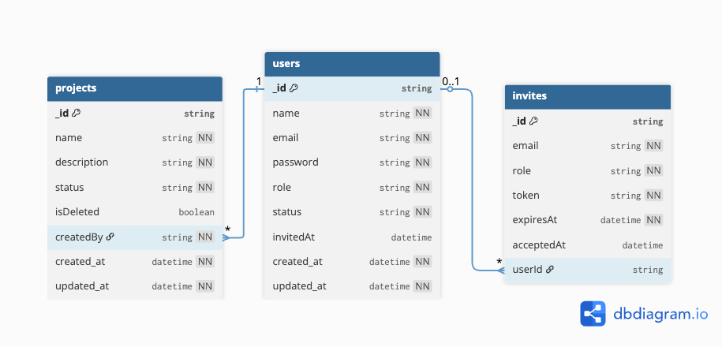

# RBAC Project Manager

## Overview

RBAC Project Manager is a Role-Based Admin & Project Management System with Invitation-Based User Onboarding. Admins can manage users and projects, while new users can only register via admin-generated invitations.

---

## Features

**1. User Management:**

- Users cannot self-register
- Admin-generated invites
- Invite token-based registration
- Role management (ADMIN | MANAGER | STAFF)
- Activate / deactivate users
- Deactivated users cannot log in

**2. Project Management:**

- Authenticated users can create projects
- Only ADMIN can edit or delete projects
- Soft delete for projects (not permanently removed)
- All users can view projects

**3. Security & Validation**

- JWT authentication
- Password hashing with bcrypt
- Protected routes with role-based access
- Request validation using Zod
- Centralized error handling

---

## Database Design (ERD)

## 

---

## REST API Endpoints

**1. Authentication:**

- `POST /auth/login` → Login with email/password
- `POST /auth/invite` → Admin generates invite
- `POST /auth/register-via-invite` → Complete registration using invite token

**2. User Management(ADMIN only):**

- `GET /users` → List all users (paginated)
- `PATCH /users/:id/role` → Update user role
- `PATCH /users/:id/status` → Activate / deactivate user

**3. Project Management:**

- `POST /projects` → Create project
- `GET /projects` → List projects
- `PATCH /projects/:id` → Edit project (ADMIN only)
- `DELETE /projects/:id` → Soft delete project (ADMIN only)

Test all endpoints with our [Postman Collection](https://documenter.getpostman.com/view/15226030/2sBXVkB9XA)

---

## Technology Stack

- **Programming Language:** TypeScript
- **Framework:** Express.js
- **Database:** MongoDB (Mongoose ODM)
- **Authentication:** JWT (JSON Web Tokens)
- **Password Hashing:** bcrypt
- **Validation:** Zod
- **Security:** CORS, Rate Limiting
- **Email Service:** Nodemailer

---

## Project Setup Instructions

1. Clone the repository:

   ```bash
   git clone https://github.com/Sabbir2809/rbac-project-manager-backend.git
   cd rbac-project-manager-backend
   ```

2. Install dependencies:
   ```bash
   yarn install
   ```
3. Setup environment variables in `.env`.

   ```bash
   NODE_ENVIRONMENT=development
   PORT=your_port
   DATABASE_URL=your_mongodb_connection_string
   CORS_ORIGIN=your_frontend_url

   # password
   BCRYPT_SALT_ROUNDS=your_bcrypt_salt_rounds

   # JWT
   JWT_ACCESS_SECRET_KEY=your_jwt_access_secret_key
   JWT_REFRESH_SECRET_KEY=your_jwt_refresh_secret_key

   # SMTP
   SMTP_USER=your_smtp_email
   SMTP_PASSWORD=your_smtp_password
   ```

4. Seed the database:

   ```bash
   # Seed sample data
   yarn seed
   ```

5. Run the development server:

   ```bash
   yarn dev
   ```
